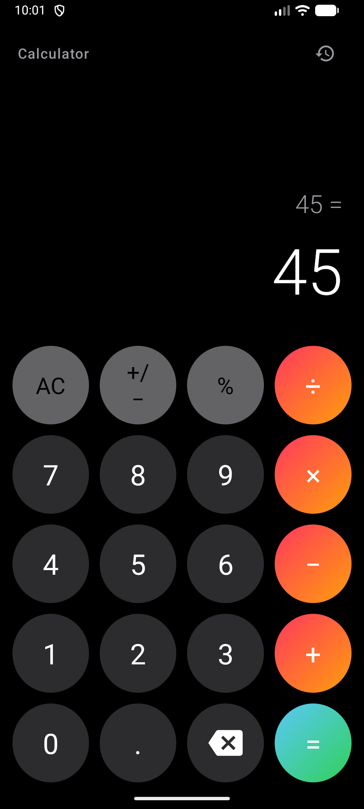
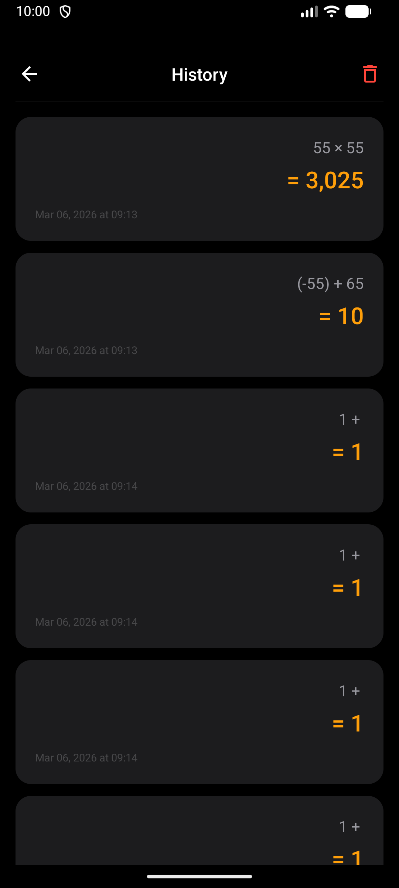
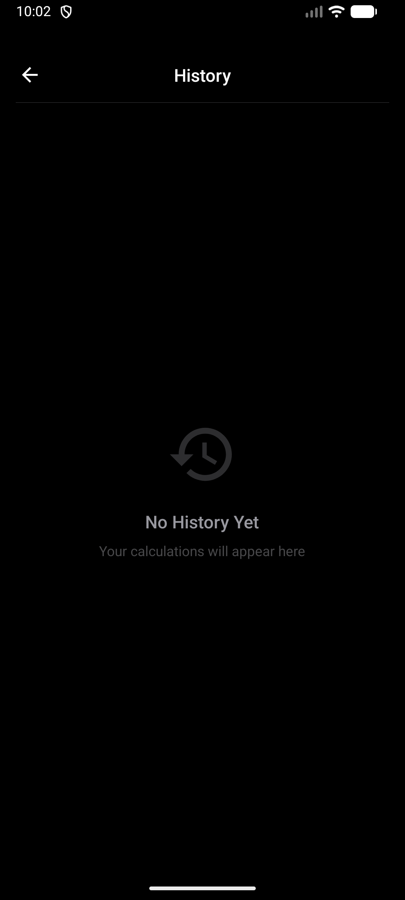
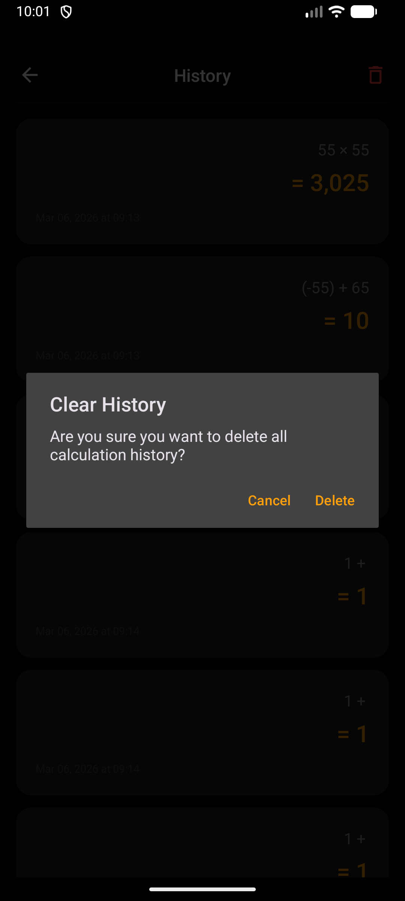

# 📱 Android Calculator App

A modern **Android Calculator application** built using **Java and Android Studio**.
The app performs essential arithmetic operations with a clean dark-themed UI and includes a **calculation history system** for tracking previous results.

This project demonstrates core Android development concepts such as **XML UI design, event handling, and implementing calculation logic in Java**.

It was created as part of my Android development learning journey and portfolio.

---

## 🚀 Features

• Basic arithmetic operations
• Addition (+)
• Subtraction (−)
• Multiplication (×)
• Division (÷)
• Percentage (%) calculations
• Decimal number support
• Sign toggle (+/−)
• Calculation history tracking
• Clear history option with confirmation dialog
• Clean dark theme interface
• Fast and responsive UI

---

## 🛠 Tech Stack

**Language:** Java
**IDE:** Android Studio
**UI Design:** XML Layouts
**Build System:** Gradle
**Platform:** Android

---

## 📷 App Preview

### Main Calculator Screen

### Calculation History

### Empty History Screen

### Clear History Confirmation

---

## 📦 Download APK

You can download and install the APK directly from the **Releases** section.

⬇ Download Latest APK
https://github.com/aajadv3rma/Android-Calculator-App/releases

### Installation Steps

1. Download the APK file
2. Enable **Install from Unknown Sources** on your Android device
3. Install and open the application

---

## ⚙️ Installation for Developers

Clone the repository:

```
git clone https://github.com/aajadv3rma/Android-Calculator-App.git
```

Open the project in **Android Studio**, allow Gradle to sync, and run the application on:

• Android Emulator
• Physical Android Device

---

## 📂 Project Structure

```
AVCalculator
│
├── app
│   ├── src
│   │   └── main
│   │       ├── java
│   │       │   └── com
│   │       │       └── avtech
│   │       │           └── avcalculator
│   │       │
│   │       ├── res
│   │       │   ├── layout
│   │       │   ├── drawable
│   │       │   ├── mipmap
│   │       │   ├── values
│   │       │   └── xml
│   │       │
│   │       └── AndroidManifest.xml
│   │
│   └── build.gradle
│
├── gradle
│   └── wrapper
│
├── build.gradle
├── settings.gradle
└── README.md
```

---

## 🎯 Learning Goals

This project helped me understand:

• Android Activity Lifecycle
• Designing user interfaces with XML
• Handling button click events
• Implementing calculation logic in Java
• Managing calculation history in an Android app
• Android project structure and Gradle build system

---

## 🔮 Future Improvements

• Scientific calculator functions
• Improved Material Design UI
• Animation enhancements
• Better expression parser for complex calculations
• Additional advanced features

---

## 👨‍💻 Author

**Aajad Verma**

GitHub:
https://github.com/aajadv3rma

---

## 📄 License

This project is licensed under the **GPL-3.0 License**.
